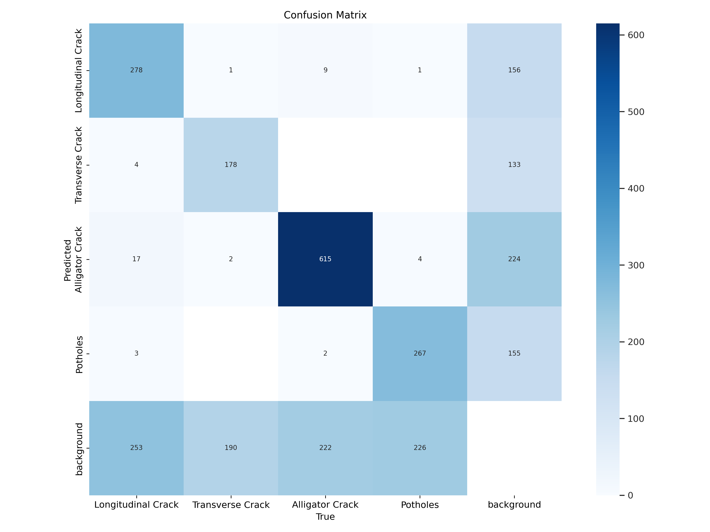

# Road Damage Detection Applications  

Road infrastructure quality plays a critical role in transportation safety and efficiency. Timely detection and classification of road surface damage can significantly reduce accidents and optimize maintenance operations.  

This project presents a **road damage detection framework** that leverages deep learning for automated damage recognition. Detection is performed on images, allowing efficient inspection without manual intervention.  

## Performing Detection Using Image  

The detection system is powered by the **YOLOv8 object detection model**, trained on the *Crowdsensing-based Road Damage Detection Challenge 2022 dataset*.  

The model achieves robust detection across four major categories of road damage:  
- **Longitudinal Cracks**  
- **Transverse Cracks**  
- **Alligator Cracks**  
- **Potholes**  

This approach demonstrates the potential of deep learning in enabling scalable, accurate, and cost-efficient solutions for smart infrastructure maintenance.

## Running on Local Server

This is the step that you take to install and run the web-application on the local server.

``` bash
# Install CUDA if available
# https://docs.nvidia.com/cuda/cuda-installation-guide-linux/index.html

# Create the python environment
conda create -n rdd python=3.8
conda activate rdd

# Install pytorch-CUDA
# https://pytorch.org/get-started/locally/
conda install pytorch==2.0.0 torchvision==0.15.0 torchaudio==2.0.0 pytorch-cuda=11.8 -c pytorch -c nvidia

# Install ultralytics deep learning framework
# https://docs.ultralytics.com/quickstart/
pip install ultralytics

# Clone the repository
git clone https://github.com/oracl4/RoadDamageDetection.git
cd RoadDamageDetection

# Install requirements
pip install -r requirements.txt

# Start the streamlit webserver
streamlit run Home.py
```

## Training

### Prepare the Dataset

Download the datasets from this [github](https://github.com/sekilab/RoadDamageDetector) and you can extract the *RDD2022.zip* files into this structure.

```
/home/oracl4/project/rdd/dataset/RDD2022/
├── RDD2022_all_countries
│   ├── China_Drone
│   │   └── train
│   │       ├── annotations
│   │       │   └── xmls
│   │       ├── images
│   │       └── labels # Created after prepare dataset process
│   ├── China_MotorBike
│   │   └── ...
│   ├── Czech
│   │   └── ...
│   ├── India
│   │   └── ...
│   ├── Japan
│   │   └── ...
│   ├── Norway
│   │   └── ...
│   └── United_States
│       └── ...
└── rawData # Not Used, .zip folder
```

Perform the dataset conversion from PascalVOC to YOLOv8 format using **0_PrepareDatasetYOLOv8.ipnb** notebook. This will also create a train and val split for the dataset due to lack of test labels on the original dataset. It will also remove excess background image from the dataset. It will copy the dataset and create a new directory on the training folder.

```
├── dataset
│   └── rddJapanIndiaFiltered
│       ├── India
│       │   ├── images
│       │   │   ├── train
│       │   │   └── val
│       │   └── labels
│       │       ├── train
│       │       └── val
│       ├── Japan
│       │   └── ...
│       └── rdd_JapanIndia.yaml # Create this file for YOLO dataset config
└── runs
```

Run the training on **1_TrainingYOLOv8.ipynb** notebook. You can change the hyperparamter and training configuration on that notebook.

## Evaluation Result

This is the training result of the YOLOv8s model that trained on the filtered Japan and India dataset with RTX2060 GPU. You can perform the evaluation on your dataset with **2_EvaluationTesting.ipynb** notebook, just convert your dataset into ultralytics format.

<p align="center">
    
    
    
</p>

## License and Citations  

- **Dataset**: Crowdsensing-based Road Damage Detection Challenge (CRDDC 2022)  
  Deepak Arya, Ankit Mangal, Abhinav Kumar, Gaurav Singh, Shubham Varshney,  
  Pranjal Kumar, Arnab Maiti, Keiji Watanabe, Daya Shankar Arya, Kohei Yasuhara, et al.  
  *Proceedings of the IEEE/CVF Conference on Computer Vision and Pattern Recognition (CVPR) Workshops, 2022*  
  [Read Paper](https://openaccess.thecvf.com/content/CVPR2022W/AI4CC/html/Arya_CRDDC22_Crowdsensing-Based_Road_Damage_Detection_Challenge_2022_CVPRW_2022_paper.html)  

- **Frameworks**:  
  - [Ultralytics YOLOv8](https://github.com/ultralytics/ultralytics) (GPL-3.0 License)  
  - [Streamlit](https://streamlit.io/) (Apache 2.0 License)  

---

This project is developed as part of an academic B.Tech project.  
Please cite the original dataset paper if you use this work in research or publications.
